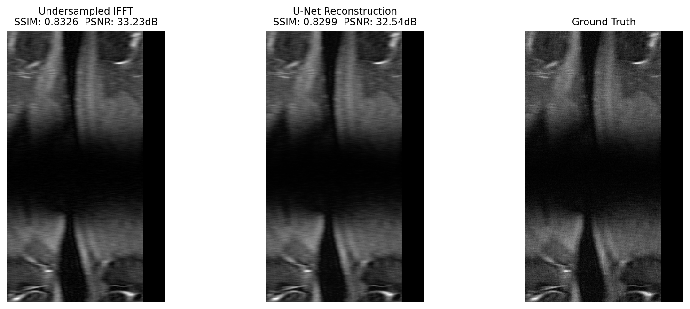

# Lacunae



Undersampled MRI reconstruction using a U-Net trained on k-space data from the [fastMRI dataset](https://fastmri.med.nyu.edu). The name comes from the Latin word for "gaps" - what undersampling literally creates in k-space.

## What it does

MRI machines collect data in k-space (the frequency domain). Full sampling is slow and uncomfortable for patients. Lacunae artificially undersamples k-space by masking out a fraction of frequency lines, then trains a U-Net to reconstruct a diagnostically useful image from the incomplete data.

At 4x acceleration, only 25% of k-space is sampled. The model learns to recover the missing structure that a naive inverse FFT cannot.

## Project structure

```
lacunae/
├── data/                   # fastMRI .h5 files (not tracked)
├── lacunae/
│   ├── dataset.py          # k-space loading, masking, and slice indexing
│   ├── model.py            # U-Net with skip connections
│   ├── transforms.py       # random Cartesian undersampling mask
│   ├── train.py            # training loop with L1 loss and checkpointing
│   └── evaluate.py         # SSIM/PSNR metrics and visualization
├── results/                # saved checkpoints and loss curves (not tracked)
├── notebooks/
│   └── explore.ipynb       # data exploration
└── requirements.txt
```

## Setup

```bash
pip install torch torchvision h5py numpy scikit-image matplotlib fastmri wandb jupyter
```

Download the fastMRI single-coil knee dataset from [fastmri.med.nyu.edu](https://fastmri.med.nyu.edu) and place it under `data/singlecoil_test/`.

## Usage

**Verify the data pipeline:**
```bash
python -m lacunae.dataset
```

**Verify the model:**
```bash
python -m lacunae.model
```

**Train:**
```bash
python -m lacunae.train
```

## Model

A standard U-Net with four encoder/decoder stages and a bottleneck:

- **Encoder:** ConvBlock(1→32) → ConvBlock(32→64) → ConvBlock(64→128) → ConvBlock(128→256)
- **Bottleneck:** ConvBlock(256→512)
- **Decoder:** mirrors the encoder with transposed convolutions and skip connections
- **Output:** sigmoid activation, single-channel reconstructed image
- **Parameters:** ~7.7M

## Training

| Parameter | Value |
|---|---|
| Loss | L1 |
| Optimizer | Adam |
| Learning rate | 1e-3 |
| Batch size | 4 |
| Acceleration | 4x |
| Center fractions | 0.08 |

Checkpoints are saved every 5 epochs to `results/`. A loss curve is saved to `results/loss_curve.png` at the end of training.

## Dataset

[fastMRI](https://fastmri.org) — NYU Langone Health / Facebook AI Research. Single-coil knee subset (~1.4GB test split, ~89GB full training set). Data is stored in HDF5 format with raw k-space per scan.

> Zbontar et al., *fastMRI: An Open Dataset and Benchmarks for Accelerated MRI*, 2018.

## Masking strategy

Random Cartesian undersampling — the standard baseline in accelerated MRI literature. The center 8% of k-space columns (low frequencies) are always retained since they carry the bulk of image energy. The remaining sampled lines are drawn uniformly at random to reach the target acceleration factor.