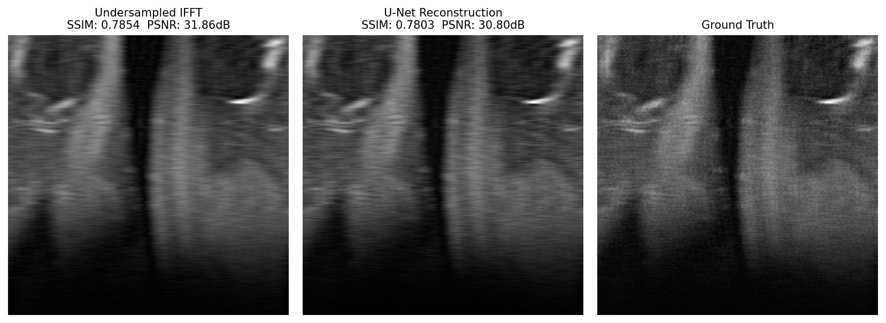

# Lacunae

> An empirical study on the effect of k-space sampling patterns for accelerated MRI reconstruction using deep learning.


*Left: Undersampled IFFT (naive baseline). Middle: U-Net reconstruction.              
Right: Ground truth. Horizontal aliasing streaks visible in the baseline are suppressed by the model.*

---

## Motivation

Most accelerated MRI reconstruction papers default to random Cartesian undersampling without justification. This study asks a simple question nobody has answered cleanly for DL-based reconstruction:

**Does the choice of k-space sampling pattern matter as much as — or more than — model architecture?**

We train the same U-Net across four mask types and three acceleration factors, producing a systematic comparison of reconstruction quality that the literature currently lacks.

---

## Study design

| Variable | Values |
|---|---|
| Sampling patterns | Random Cartesian, Equispaced, Radial, Variable-density |
| Acceleration factors | 4x, 8x, 16x |
| Model | U-Net (fixed architecture across all runs) |
| Metrics | SSIM, PSNR |
| Dataset | fastMRI single-coil knee |

12 total training runs. Results reported as mean SSIM and PSNR on the held-out test split.

---

## Sampling patterns

**Random Cartesian** — the de facto standard. Randomly samples k-space columns while always retaining the center low-frequency region. Used as the baseline for comparison.

**Equispaced** — samples every Nth column uniformly. Deterministic and hardware-friendly but produces coherent aliasing artifacts.

**Radial** — samples columns with probability weighted by distance from k-space center, simulating radial acquisition. Denser at low frequencies where image energy is concentrated.

**Variable-density** — quadratic falloff from center, providing a smooth transition between dense low-frequency sampling and sparse high-frequency sampling.

---

## Model

A standard U-Net with four encoder/decoder stages — held fixed across all experimental conditions so that observed differences in reconstruction quality are attributable to the sampling pattern, not the model.

- **Encoder:** ConvBlock(1→32) → ConvBlock(32→64) → ConvBlock(64→128) → ConvBlock(128→256)
- **Bottleneck:** ConvBlock(256→512)
- **Decoder:** mirrors encoder with transposed convolutions and skip connections
- **Loss:** L1 + SSIM
- **Parameters:** ~7.7M

---

## Project structure

```
lacunae/
├── data/                   # fastMRI .h5 files (not tracked)
├── assets/                 # visuals for this README
├── dataset.py              # k-space loading, masking, slice indexing
├── model.py                # U-Net
├── transforms.py           # all four sampling mask implementations
├── train.py                # training loop with checkpointing
├── evaluate.py             # SSIM/PSNR metrics and reconstruction visuals
├── results/                # checkpoints and loss curves (not tracked)
└── requirements.txt
```

---

## Setup

```bash
pip install torch torchvision h5py numpy scikit-image matplotlib torchmetrics
```

Download the fastMRI single-coil knee dataset from [fastmri.med.nyu.edu](https://fastmri.med.nyu.edu) and place it under `data/singlecoil_test/`.

---

## Usage

**Train** (set `mask_type` and `acceleration` in `train.py`):
```bash
python train.py
```

**Evaluate:**
```bash
python evaluate.py
```

---

## Dataset

[fastMRI](https://fastmri.org) — NYU Langone Health / Facebook AI Research. Single-coil knee subset. Data stored in HDF5 format with raw k-space per MRI volume.

> Zbontar et al., *fastMRI: An Open Dataset and Benchmarks for Accelerated MRI*, 2018.

---

## Status

- [x] Random Cartesian baseline — trained and evaluated at 4x, 8x
- [ ] Equispaced mask implementation
- [ ] Radial mask implementation  
- [ ] Variable-density mask implementation
- [ ] Full 4×3 experimental grid
- [ ] Results table and analysis